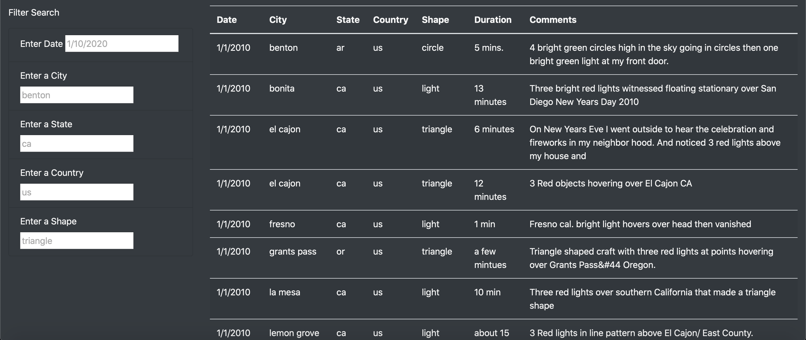

# UFOs
## Overview
The purpose of this project is to create a responsive webpage with a dynamic table that will allow users or visitors of the webpage to filter for multiple criteria at the same time such as date, city, state, country and shape, in order to get indepth analysis of UFOs sightings.
## Results
HTML, CSS, and JavaScript were used to create a responsive and aesthetic webpage, create filter forms and data table as below picture.

JavasScript is also used to create functions that filter the data table automatically as the user inserts the criteria in the filter form.
When a user types in a date, the data table will be filtered based on the date inserted.
If the user wants to know UFOs sightings by city, the table can also be filtered based on that alone or in combination with a particular date as shown in the picture below.

More so, the user has the flexibility to filter the table based on the country, state, shape, city, and/or date, depending on the goals of the users.

## Summary
Despite how responsive and intuitive this website is, it is just one page website. Also, it has no additional links for references.
This can be improved, by adding additional pages of other articles that has been written on UFOs sightings. 
Images of UFOs can be added to the webpage to aid the understanding of the users of the page who have little understanding about UFOs.

